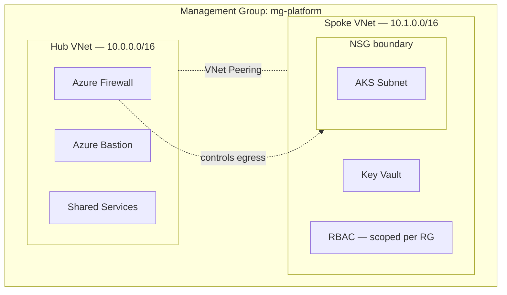

# Azure Landing Zone in Terraform

A hub-and-spoke landing zone: hub VNet with Azure Firewall and Bastion, a spoke VNet with an NSG-bounded subnet for AKS, a Key Vault locked to that subnet, and RBAC scoped per resource group instead of the subscription.

Started because I kept copy-pasting the same networking module between two "environments" and got tired of it. This is the parameterized version — a second environment is a new `terraform.tfvars`, not a copy-pasted module.

```
azure-landing-zone-terraform/
├── modules/
│   ├── hub-network/      # hub VNet + AzureFirewallSubnet + AzureBastionSubnet + shared services subnet
│   ├── spoke-network/    # spoke VNet + NSG-bounded AKS subnet
│   ├── peering/          # hub <-> spoke VNet peering, both directions
│   ├── firewall/         # Azure Firewall + policy, deny-by-default egress rule collection
│   ├── bastion/          # Azure Bastion, so no VM needs a public IP
│   ├── key-vault/        # RBAC-authorized Key Vault, network ACL locked to the AKS subnet
│   └── rbac/             # role assignments scoped to a resource group, never the subscription
└── environments/
    ├── dev/
    └── prod/
```

## Design decisions

- **Hub-and-spoke instead of a flat network.** The firewall and Bastion live in the hub once. Every spoke peers to it instead of reinventing them.
- **NSG at the spoke boundary.** The AKS subnet doesn't inherit trust from the rest of the VNet by default — inbound is deny-all except explicit VNet-to-VNet traffic.
- **Bastion, not a jump box with a public IP.** An earlier version of this project had a VM with a public IP "just for testing." Fixed here on purpose — `azurerm_bastion_host` is the only way into the network for admin access.
- **RBAC scoped to the resource group.** The `rbac` module takes a resource group ID as its scope, not a subscription ID. One broad Owner/Contributor role covering everything is exactly what this avoids.
- **Key Vault uses RBAC authorization, not access policies**, and its network ACL default-denies everything except the AKS subnet and Azure services.

## Prerequisites

- Terraform >= 1.7
- An Azure subscription, and `az login` already done (or a service principal with `ARM_CLIENT_ID` / `ARM_CLIENT_SECRET` / `ARM_TENANT_ID` / `ARM_SUBSCRIPTION_ID` set)
- A storage account + container for remote state, created once by hand before the first `terraform init` (this config can't bootstrap the backend that stores its own state)

```bash
# one-time backend bootstrap (adjust names as needed)
az group create -n rg-tfstate -l centralindia
az storage account create -n sttfstatelandingzone -g rg-tfstate -l centralindia --sku Standard_LRS
az storage container create -n tfstate --account-name sttfstatelandingzone
```

## Usage

```bash
cd environments/dev
terraform init
terraform plan -out=tfplan
terraform apply tfplan
```

Before applying, change `key_vault_name` in `terraform.tfvars` — Key Vault names are globally unique across all of Azure, so `kv-lz-dev-ak01` will collide with mine.

To stand up a second environment, don't copy the modules — just `cd environments/prod` and run the same commands. `prod/terraform.tfvars` uses a different address space (`10.10.0.0/16` / `10.11.0.0/16` vs dev's `10.0.0.0/16` / `10.1.0.0/16`) so both could theoretically peer without a CIDR clash later.

## What this doesn't do yet

- No Azure Policy at the management group level — governance is the next thing I'm adding, not here yet
- No private endpoint on the Key Vault in this repo specifically — network ACL + RBAC is the boundary here; the private-endpoint pattern lives in the AKS platform repo where I use it end-to-end
- `terraform destroy` has been tested; nothing here has run under real traffic or load

## Diagram


