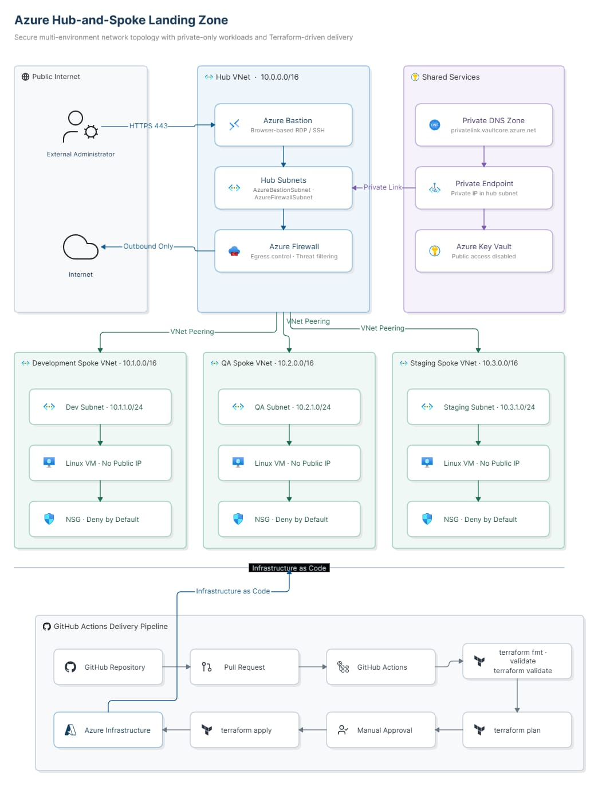

<<<<<<< HEAD


## 1. Azure Landing Zone — Hub-and-Spoke Network

🔗 **Repo:** [azure-landing-zone-terraform](https://github.com/aniket-devop/azure-landing-zone-terraform)
`Terraform` `Azure Firewall` `Bastion` `Key Vault` `Private DNS` `GitHub Actions`

A hub-and-spoke enterprise network topology — the same pattern Microsoft recommends for real Azure landing zones — built entirely from reusable Terraform modules, with centralized security (Firewall + Bastion) and zero public exposure on workload VMs.

### Architecture Diagram


<details>
<summary><b>📖 Architecture Flow — click to expand</b></summary>

1. Admin connects to **Azure Bastion** over HTTPS (443) — no VM ever has a public IP.
2. Bastion proxies RDP/SSH internally to VMs in the spoke VNets.
3. All inter-VNet traffic between hub and spokes flows through **VNet Peering**, routed and inspected by **Azure Firewall**.
4. Outbound internet access from spokes is forced through the firewall (no direct egress from workloads).
5. Application secrets/connection strings are pulled from **Key Vault** via a **Private Endpoint**, resolved through a **Private DNS Zone** — never over the public Key Vault endpoint.
6. Every subnet in the spokes sits behind a **deny-by-default NSG**; only explicitly required ports are opened.
7. Infrastructure changes go through GitHub Actions: `terraform plan` and `validate` run automatically on every PR, and `apply` requires manual approval — no direct `apply` from a laptop.

</details>

<details>
<summary><b>📁 Folder Structure</b></summary>
=======
# Azure Hub-and-Spoke Network Foundation (Terraform)


A Terraform-built Azure networking and security foundation: one hub VNet (Azure Firewall + Bastion), one spoke VNet with a deny-by-default NSG and an AKS-named subnet, egress forced through the Firewall via a route table, an RBAC-authorized Key Vault, and role assignments scoped to the resource group instead of the subscription. Built and re-deployable across two environments (`dev`, `prod`) from a single, DRY Terraform configuration.

This is a personal, sandbox-scale project — not a multi-subscription enterprise landing zone. See [What this is / isn't](#what-this-is--isnt) below before assuming otherwise.



## What this is / isn't

**Is:** a networking + security foundation — VNets, Firewall, Bastion, NSGs, routing, Key Vault access control, and least-privilege RBAC, all as reusable Terraform modules, correctly wired and re-deployable per environment.

**Isn't:** an Azure landing zone in the Microsoft Cloud Adoption Framework sense (no management-group hierarchy, no Azure Policy, no multi-subscription governance), and doesn't yet run any actual workload — there's no VM or AKS cluster deployed, just the network and subnet the AKS cluster would eventually sit in.

## Key engineering decisions

| Decision | Why |
|---|---|
| RBAC scoped to the resource group, not the subscription | A compromised credential's blast radius is one resource group, not everything in the subscription |
| NSG explicit `DenyAllInbound` at priority 4096, rather than relying on Azure's platform defaults | Makes the deny-by-default posture visible and version-controlled instead of implicit |
| Azure Bastion instead of a jump box with a public IP | Removes an entire class of attack surface — no VM in this design needs its own public IP |
| Route table forcing `0.0.0.0/0` from the AKS subnet to the Firewall's private IP | A Firewall's allow-rules only matter if traffic is actually routed to it — this is what makes "centralized egress control" true rather than aspirational |
| Key Vault: RBAC authorization + network ACL (not a Private Endpoint) | A deliberate, smaller-scope control for a project this size — the trade-off is documented, not hidden ([details](docs/architecture.md#known-limitations)) |
| `dev`/`prod` share one `main.tf`, differing only in `.tfvars` | Environment parity by construction — a change to the network design can't drift between environments |

## Technology stack

Terraform · Azure Virtual Network · Azure Firewall · Azure Bastion · Azure Key Vault · Azure RBAC · GitHub Actions

## Module structure
>>>>>>> d47a716 (Replace personal profile README with accurate project README)

```
azure-landing-zone-terraform/
├── modules/
│   ├── hub-network/     # Hub VNet + AzureFirewallSubnet, AzureBastionSubnet, shared-services subnet
│   ├── spoke-network/   # Spoke VNet + snet-aks, deny-by-default NSG
│   ├── peering/         # Symmetric hub<->spoke VNet peering
│   ├── firewall/        # Azure Firewall, default-deny policy, explicit allow rules (HTTPS, DNS)
│   ├── bastion/         # Azure Bastion host, no public IP on any workload
│   ├── key-vault/       # Key Vault: RBAC authorization + network ACL
│   └── rbac/            # Role assignments scoped to a resource group
├── environments/
│   ├── dev/             # Composes every module above + a route table forcing egress through the Firewall
│   └── prod/            # Identical main.tf to dev — different .tfvars only
├── docs/architecture.md # Design decisions, trade-offs, and current limitations
├── tests/README.md      # Honest status: no automated tests exist yet, and why
├── CHANGELOG.md
└── .github/workflows/terraform-ci.yml
```

## Environment strategy

`dev` and `prod` are two instances of the same module composition (`environments/*/main.tf` is identical between them), differing only in `.tfvars` — address spaces, resource names, and tags. There is no separate QA or staging environment.

## Security controls

- **Network**: deny-by-default NSG on the spoke subnet; all subnet egress forced through Azure Firewall via a route table (not just an allow-listed firewall sitting unused).
- **Firewall**: default-deny policy with two explicit allow rules (outbound HTTPS, outbound DNS) — everything else from the spoke is dropped.
- **Admin access**: Azure Bastion only — no VM in this design has, or needs, a public IP.
- **Key Vault**: RBAC authorization (not legacy access policies) plus a network ACL restricting access to the AKS subnet. No Private Endpoint in this repo — see [`docs/architecture.md`](docs/architecture.md) for why and what the trade-off is.
- **IAM**: every role assignment scoped to a resource group via the `rbac` module — never a subscription-level `Owner`/`Contributor` grant.

## CI/CD

`.github/workflows/terraform-ci.yml` runs on every PR to `main` and every push to `main`:

```
terraform fmt -check -recursive
terraform init -backend=false   (environments/dev)
terraform validate              (environments/dev)
```

That's the whole pipeline. No `terraform plan`, no `apply` automation, no manual approval gate, no Checkov/tfsec/TFLint, no OIDC — those aren't implemented, and this README won't claim they are. A small, honest, green pipeline beats a large one nobody's verified.

## How to validate

```bash
cd environments/dev   # or environments/prod
terraform init
terraform validate
```

## Remote state

Both environments use an `azurerm` backend (`backend.tf`) pointing at a storage account + container that's created once, by hand, before the first `terraform init`:

```bash
az group create -n rg-tfstate -l centralindia
az storage account create -n <globally-unique-name> -g rg-tfstate -l centralindia --sku Standard_LRS
az storage container create -n tfstate --account-name <globally-unique-name>
```

Update `storage_account_name` in `environments/*/backend.tf` to match before running `init`.

## Current limitations

- No compute deployed — no VM, no AKS cluster. The `snet-aks` subnet, NSG, and Key Vault access rule exist; the cluster that would use them doesn't yet.
- No Private Endpoint / Private DNS Zone for Key Vault — network ACL + RBAC is the actual boundary (see [`docs/architecture.md`](docs/architecture.md)).
- No `terraform plan`/`apply` automation, no manual approval gate, no security scanning in CI yet.
- No automated tests — an earlier draft `terraform test` referenced guessed resource names instead of the real ones and was deliberately removed rather than left in place looking real ([`tests/README.md`](tests/README.md)).
- Single subscription, no management-group hierarchy, no Azure Policy.

## Roadmap

- `terraform plan` posted as a PR comment in CI (before adding `apply` automation).
- Real `terraform test` coverage against the actual module resource names.
- Screenshots of a real `terraform plan`/`apply` run and the deployed resource group in the Azure Portal.

## License

[MIT](LICENSE)
