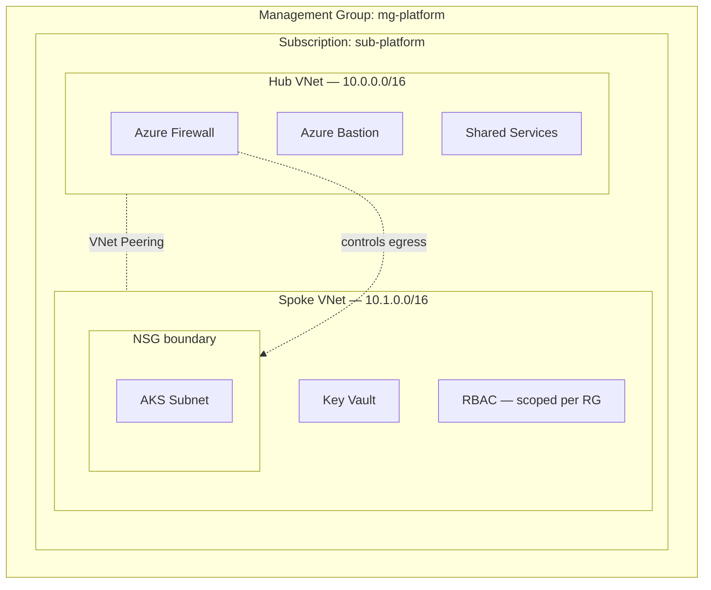
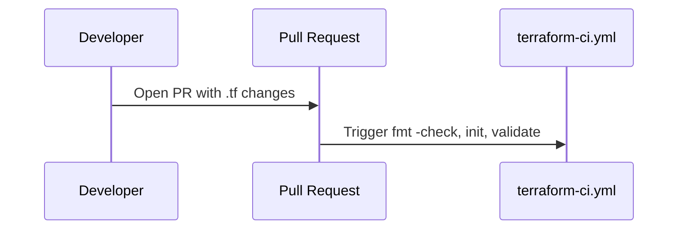

# Architecture

## Overview

## CI status (current, real)

That's the entire pipeline right now. No security scanning, no plan posting, no apply automation — those are TODOs below, not implemented features. This diagram gets updated only after each one is actually added and confirmed working in a real Actions run.

## Design decisions and trade-offs

| Decision | Alternative considered | Why this one |
|---|---|---|
| Hub-and-spoke | Flat single VNet | Centralizes firewall/Bastion once instead of duplicating per spoke |
| NSG deny-by-default at spoke boundary | Relying on VNet-level trust | AKS subnet shouldn't inherit trust from anything else on the VNet |
| Azure Bastion | Jump box with public IP | No VM needs a public IP; removes an entire attack surface class |
| RBAC scoped to resource group | Subscription-level Owner/Contributor | Blast radius of a compromised credential is one RG, not the subscription |
| Manual apply (planned, not built yet) | Auto-apply on merge to main | Want a human to read the plan before anything changes state — this is a decision, not yet a working workflow |

## 📝 TODO: Apply workflow

There is currently **no apply automation in this repo at all** — `terraform apply` has only ever been run manually from a local machine (per the original project notes). A `workflow_dispatch`-triggered apply workflow, gated by a GitHub environment protection rule, is a planned next step, not something that exists yet. It will be added and documented here once it's built and actually run successfully at least once.

## Known limitations

- No Azure Policy at the management group level yet (tracked in [Issues](../../issues)).
- No private endpoint on Key Vault in this repo — network ACL + RBAC is the boundary here. The private-endpoint pattern is used end-to-end in the AKS platform repo instead.
- Only `terraform destroy` and `terraform plan` have been run against a real subscription. No load testing, no chaos testing.
